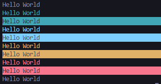

# About

An easy-to-use colorized console for node.js.
Log **colorized** and **styled** texts on the console!



## Installation

```
npm i jm-console
```

## Usage

```javascript
const { console, colors } = require('jm-console');

console.log(message, styles);

console.success(message, styles);
console.successBG(message, styles);

console.info(message, styles);
console.infoBG(message, styles);

console.warning(message, styles);
console.warningBG(message, styles);

console.error(message, styles);
console.errorBG(message, styles);

console.custom(message, color, styles);
```

### Examples

```javascript
console.log('Hello World');

console.log('Hello World', { bold: true });

console.success('Hello World', { bold: true, italic: true });

console.custom('Hello World', colors.Blue, { bold: true });
```

## Styles Object

| Property    | Type    | Description                     |
| ----------- | ------- | ------------------------------- |
| bold        | Boolean | Makes the text bold             |
| italic      | Boolean | Makes the text italic           |
| underscore  | Boolean | Adds underscore to the text     |
| lineThrough | Boolean | Adds a line through to the text |

## Colors

`Black` | `Red` | `Green` | `Yellow` | `Blue` | `Magenta` | `Cyan` | `White` | `Gray` | `RedLight` | `GreenLight` | `YellowLight` | `BlueLight` | `MagentaLight` | `CyanLight` | `WhiteLight` | `BgBlack` | `BgRed` | `BgGreen` | `BgYellow` | `BgBlue` | `BgMagenta` | `BgCyan` | `BgWhite` | `BgGray` | `BgRedLight` | `BgGreenLight` | `BgYellowLight` | `BgBlueLight` | `BgMagentaLight` | `BgCyanLight` | `BgWhiteLight` |
